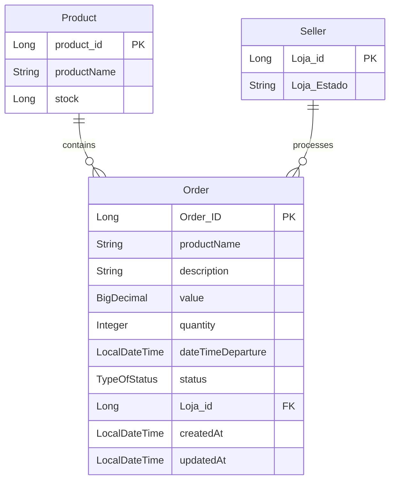

# Loja Online Simplificada - Projeto de Treinamento

## Descrição

Este projeto é parte de um treinamento na Accenture, com o objetivo de criar uma loja online simplificada utilizando Java Spring Boot, RabbitMQ e MySQL. O sistema simula uma loja onde produtos podem ser comprados e o processo de pagamento é assíncrono. O uso do RabbitMQ é fundamental para garantir a comunicação entre diferentes partes do sistema, como o gerenciamento de pedidos e o processamento de pagamento.

## Tecnologias Utilizadas

- **Java 21**
- **Spring Boot** (para desenvolvimento da API RESTful)
- **RabbitMQ** (para comunicação assíncrona entre sistemas)
- **Spring Data JPA** (para persistência de dados)
- **MySQL** (banco de dados utilizado)
- **IntelliJ IDEA** (IDE utilizada para o desenvolvimento)
- **Docker** (para rodar o RabbitMQ e o MySQL)
- **WSL** (se estiver utilizando Windows)

## Funcionalidades

- **Criação de Produtos**: Adicionar, listar e editar produtos disponíveis na loja.
- **Cadastro de Pedidos**: O cliente pode realizar pedidos de produtos e visualizar seu status.
- **Comunicação Assíncrona**: Utilização do RabbitMQ para enviar e processar pedidos de maneira assíncrona.
- **Simulação de Pagamento**: O sistema simula o processo de pagamento com confirmação assíncrona.

## Estrutura do Projeto

- **src/main/java/com/loja**:
  - **controllers**: Contém os controladores REST para expor a API.
  - **models**: Define os modelos de dados como Produto, Pedido e Pagamento.
  - **repositories**: Interfaces para acessar o banco de dados.
  - **services**: Lógica de negócios, incluindo interação com o RabbitMQ.
  - **configurations**: Configuração do RabbitMQ, MySQL e do Spring Boot.
  
- **src/main/resources**:
  - **application.properties**: Configurações do Spring Boot, RabbitMQ e MySQL.

## Como Rodar

### 1. Pré-requisitos
- **JDK 21** ou superior.
- **RabbitMQ** e **MySQL** instalados e em execução localmente (via Docker).
- **Docker** instalado.
- **WSL** (se estiver utilizando Windows).
- **Maven** ou **Gradle** (dependendo da sua preferência para gerenciar dependências).

### 2. Rodando o Projeto

Clone o repositório:

git clone https://github.com/usuario/loja-online-simplificada.git
cd loja-online-simplificada

 ##  Configuração do RabbitMQ e MySQL com Docker
   
Antes de rodar o projeto, é necessário ter o RabbitMQ e o MySQL em execução. Você pode iniciar ambos com o Docker utilizando o seguinte comando:

```bash
docker-compose up -d

docker-compose.yml:
```

Acesse a interface de gerenciamento do RabbitMQ em http://localhost:15672 com o usuário guest e a senha guest. O MySQL estará disponível em localhost:8000.

A aplicação estará disponível nas portas http://localhost:8080, http://localhost:8081, http://localhost:8082, http://localhost:8083 e http://localhost:8084.
Endpoints da API

## Como Usar
Criar um Produto:

    Acesse o endpoint POST /produtos para criar um novo produto, fornecendo nome, descrição, preço e estoque.

Criar uma Loja:

    Acesse o endpoint POST /lojas para criar sua loja, incluindo nome, descrição e localização.

Criar uma Ordem:

    Acesse o endpoint POST /pedidos para criar uma ordem, associando um produto e informando os detalhes da compra.

## Modelo logico do banco de dados

Licença

Este projeto é licenciado sob a MIT License - veja o arquivo LICENSE para mais detalhes.

Autores

    Matheus Henrique Ferreira - Desenvolvedor
    Ailton Neto - Desenvolvedor

Se tiver alguma dúvida ou sugestão, sinta-se à vontade para abrir uma issue ou enviar um pull request!
